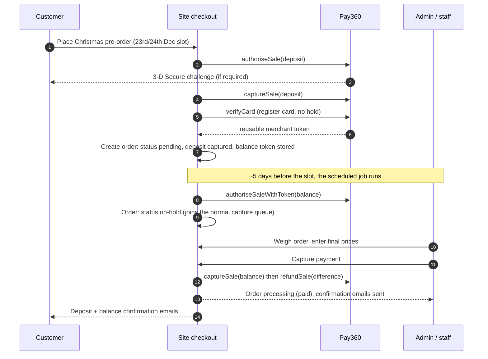

# Pay360 deposit integration - onboarding notes

> For the Pay360 merchant onboarding / developer-portal call. Summarises the deposit model and the exact
> things to confirm before implementing `src/lib/cardstream/real-client.ts` (currently every method throws;
> the whole flow is exercised against `src/lib/cardstream/mock-client.ts` with `CARDSTREAM_MOCK=true`).

## The deposit model

On a Christmas pre-order the customer pays a fixed **deposit** immediately at checkout, and the card is
**verified** (registered for later reuse, no hold) for the outstanding **balance**. A few days before the
delivery/collection slot a scheduled job places the real authorisation on that balance using the stored
merchant token, and staff capture it once the order is weighed.

- Deposit amount is staff-set in the admin area (`£`, default **off**).
- Why: a card authorisation expires after **7 days**, but pre-orders are placed weeks earlier. A deposit means
  the shop holds guaranteed money up front, and only the small balance is still exposed to expiry/decline near
  the date.

## Flow

## Confirm with Pay360

1. **Hosted Payment Fields token endpoint** - the exact Direct Integration endpoint + request/response shape for
   the tokenised card-capture flow (needed for every operation, the deposit included).
2. **Does Account Verification trigger 3DS?** `verifyCard` currently assumes no challenge. If it can challenge,
   we need a `requires_action` variant plus a confirm step.
3. **Combined "sale" call?** Can we authorise + settle the deposit in one call, or must it be `authorise` then
   `capture` (two calls)? Partial capture is already confirmed unsupported, so the deposit is its own
   transaction of exactly the deposit amount.
4. **Webhook authentication** - the current HMAC-signature assumption is wrong. Pay360 authenticates inbound
   notifications by **source IP (185.161.164.0/22)**. Confirm this before wiring live webhooks.

## Open items for the real integration

- Implement `src/lib/cardstream/real-client.ts` (all six methods currently throw).
- Replace `verifyWebhookSignature` with a source-IP allowlist check.
- Confirm whether the reusable token from `verifyCard` can be spent unattended (merchant-initiated, no 3DS) -
  this is the mechanism the scheduled balance re-authorisation relies on.